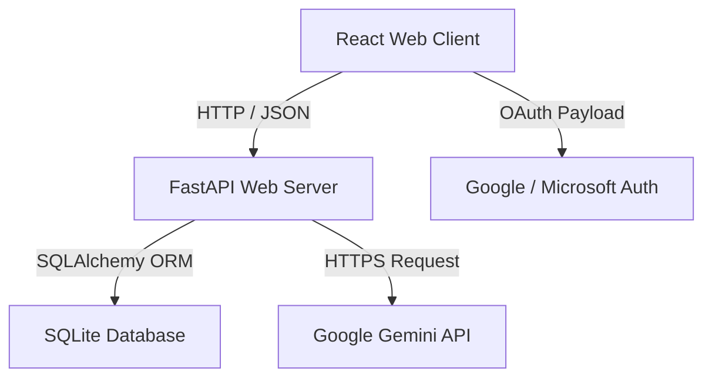

# 📝 FortuneForge Project Submission Document

## 1. Project Overview

*   **Project Title:** FortuneForge (Gamified Wealth Engine)
*   **Developer:** Sharv
*   **System Type:** Gamified Financial Intelligence Platform
*   **Target Audience:** Students, young professionals, and individuals seeking to improve their financial literacy through interactive, gaming-inspired interfaces.

---

## 2. Objective & Motive

Managing personal finance is traditionally seen as dry, intimidating, and tedious. As a result, many young adults avoid budgeting, emergency planning, or investing until late in life.

**FortuneForge** was created to address this behavioral gap by applying core gamification and behavioral economic principles. The platform translates essential personal finance indices into RPG mechanics, creating a system of intrinsic rewards and visual progression:
1.  **Transforming Metrics:** Essential savings become a "Budget Shield" that must be maintained; debt burden becomes "Cash Flow Mana" drain.
2.  **AI Mentorship:** Utilizing Google Gemini AI to provide context-aware, hyper-personalized financial planning advice without the need for an expensive advisor.
3.  **Active Engagement:** A weekly quest engine that encourages squires to audit real-world expenses, learn investment principles, and complete practical micro-tasks.

---

## 3. Core Features & RPG Translation

| Financial Reality | RPG Attribute | Platform Behavior |
| :--- | :--- | :--- |
| **Emergency Savings** | 🛡️ Budget Shield | 3 months of essential expenses represents 100% Shield Health. Depositing money in the simulator adds +25 XP. |
| **Savings surplus & Debt** | ⚡ Cash Flow Mana | A high savings rate boosts your Mana recovery. Active simulator debt drains Mana. Paying off debt awards +35 XP. |
| **Risk Tolerance Profile** | 🧙 Character Class | Onboarding categorizes users as *Gilt Defender* (Conservative), *Compounding Squire* (Balanced), *Leveraged Knight* (Growth), or *Arbitrage Wizard* (Speculative). |
| **Financial Progress** | 📈 XP & Levels | Completing quests, paying simulator debt, and hitting emergency savings targets grants XP. Every 500 XP promotes the user to a new Level. |
| **Financial Audits** | 📜 Quest Board | Active weekly quests targeting subscription audits, expense categorization, and net worth checks. |
| **AI Advisor** | 🤖 AI Coach | A chatbot that pulls profile metrics in real-time, providing immediate advice context-adapted to your character class and budget. |

---

## 4. System Architecture

FortuneForge uses a decoupled, modern architecture:



### 4.1 Database Schema (SQLite)
The user table stores both authentication, profile state, and RPG attributes:
```sql
CREATE TABLE users (
    id INTEGER PRIMARY KEY AUTOINCREMENT,
    email TEXT UNIQUE NOT NULL,
    password_hash TEXT NULL,
    google_id TEXT UNIQUE NULL,
    microsoft_id TEXT UNIQUE NULL,
    income REAL DEFAULT 0,
    expenses REAL DEFAULT 0,
    risk_profile TEXT DEFAULT '',
    character_class TEXT DEFAULT '',
    baseline_configured INTEGER DEFAULT 0,
    xp INTEGER DEFAULT 350,
    completed_quests TEXT DEFAULT '',
    name TEXT DEFAULT '',
    profile_picture TEXT DEFAULT '',
    created_at DATETIME DEFAULT CURRENT_TIMESTAMP
);
```

---

## 5. Deployment Plan

*   **Frontend Environment:** Built with Vite and React, ready for static deployment to GitHub Pages or Netlify.
*   **Backend Environment:** Containerized FastAPI app suitable for deployment on Railway, Render, or fly.io.
*   **Database:** Configured with SQLite for simplicity, easily migrated to PostgreSQL for horizontal scale.
